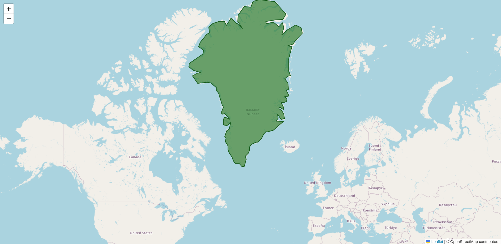
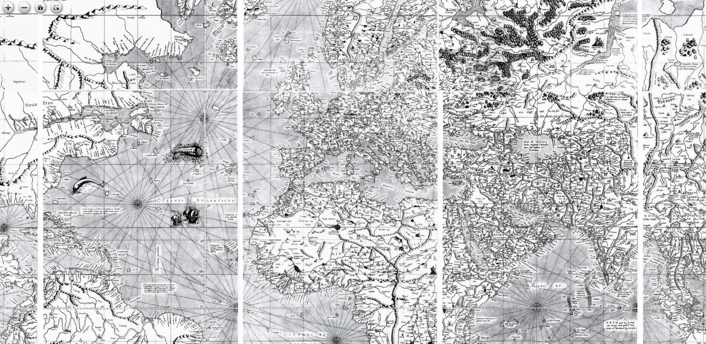

# Mercator Project Collection

A collection of interactive web apps exploring the Mercator map.

These demos were used in my post about the 1569 Mercator World Map. Read the post here: <https://ethmarks.github.io/posts/mercator>

## Projects

### Greenland Distortion Demo

**[Try it live →](https://ethmarks.github.io/mercator/greenland/)**

A simple interactive demonstration of how the Mercator projection distorts the size of landmasses at different latitudes. Drag Greenland around the world and watch how its apparent size changes due to projection distortion.

### Mercator's 1569 World Map Viewer

**[Explore the map →](https://ethmarks.github.io/mercator/seadragon-viewer/)**

An interactive high-resolution viewer for exploring Gerardus Mercator's original 1569 world map. Zoom in to see incredible details of this historic cartographic masterpiece that revolutionized navigation.

## Technical Details

Both projects are built with modern web technologies:
- Interactive mapping with Leaflet.js and D3.js
- High-resolution image viewing with OpenSeadragon
- Hosted on GitHub Pages

## License

Apache 2.0 License - see [LICENSE](LICENSE) for details.
